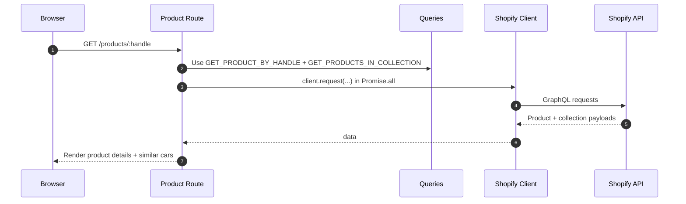
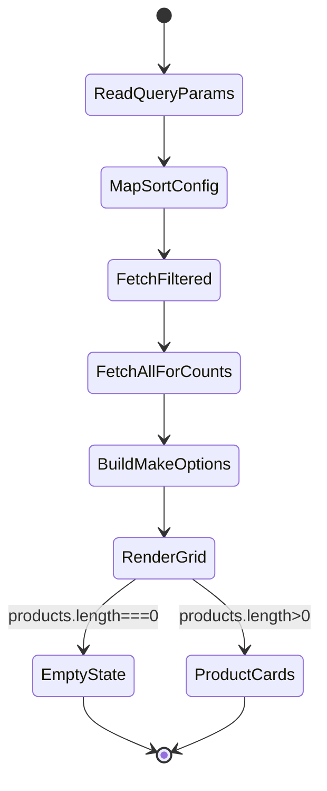

# Enermation Website

**Next.js 16**  Storefront and marketing site for Enermation, with Shopify Storefront API integration, collection browsing, and product detail pages.

## At  glance

| Area | What it does | Source |
|---|---|---|
| `web/` | Main Next.js application (App Router, React 19, Biome scripts) | [web/package.json:1-55](https://github.com/syedaliabbas1/enermation-website/blob/main/web/package.json#L1-L55) |
| `web/lib/shopify.ts` | Creates the Storefront API client and enforces required env vars | [web/lib/shopify.ts:3-17](https://github.com/syedaliabbas1/enermation-website/blob/main/web/lib/shopify.ts#L3-L17) |
| `web/lib/queries.ts` | Centralized GraphQL queries for products, collections, and cart | [web/lib/queries.ts:3-441](https://github.com/syedaliabbas1/enermation-website/blob/main/web/lib/queries.ts#L3-L441) |
| `web/app/page.tsx` | Homepage sections + collection fetch from Shopify | [web/app/page.tsx:104-161](https://github.com/syedaliabbas1/enermation-website/blob/main/web/app/page.tsx#L104-L161) |
| `web/app/collections/[handle]/page.tsx` | Server-side sorting/filtering and collection rendering | [web/app/collections/[handle]/page.tsx:30-90](https://github.com/syedaliabbas1/enermation-website/blob/main/web/app/collections/%5Bhandle%5D/page.tsx#L30-L90) |
| `web/app/products/[handle]/page.tsx` | Product detail page + metadata + similar cars | [web/app/products/[handle]/page.tsx:73-126](https://github.com/syedaliabbas1/enermation-website/blob/main/web/app/products/%5Bhandle%5D/page.tsx#L73-L126) |

## Architecture

```mermaid
flowchart LR
  U[User Browser] --> N[Next.js App Router<br>web/app]
  N --> H[Homepage<br>app/page.tsx]
  N --> C[Collections Page<br>app/collections/[handle]/page.tsx]
  N --> P[Product Page<br>app/products/[handle]/page.tsx]
  H --> Q[GraphQL Queries<br>web/lib/queries.ts]
  C --> Q
  P --> Q
  Q --> S[Shopify Client<br>web/lib/shopify.ts]
  S --> API[Shopify Storefront API]

  classDef dark fill:#2d333b,stroke:#6d5dfc,color:#e6edf3;
  class U,N,H,C,P,Q,S,API dark;
```
<!-- Sources: web/app/page.tsx:104, web/app/collections/[handle]/page.tsx:62, web/app/products/[handle]/page.tsx:91, web/lib/queries.ts:3, web/lib/shopify.ts:13 -->

### Product page request flow


<!-- Sources: web/app/products/[handle]/page.tsx:94-125, web/lib/queries.ts:51-180, web/lib/shopify.ts:13-19 -->

### Collection filtering behavior


<!-- Sources: web/app/collections/[handle]/page.tsx:30-90, web/app/collections/[handle]/page.tsx:161-171 -->

## Why this structure

The app keeps **Shopify access centralized** (`web/lib/shopify.ts`, `web/lib/queries.ts`) so pages stay focused on rendering and route-level behavior, not API client setup. This reduces duplication and makes query updates straightforward across homepage, collections, and product pages.  
Sources: [web/lib/shopify.ts:13-19](https://github.com/syedaliabbas1/enermation-website/blob/main/web/lib/shopify.ts#L13-L19), [web/lib/queries.ts:3-441](https://github.com/syedaliabbas1/enermation-website/blob/main/web/lib/queries.ts#L3-L441), [web/app/page.tsx:104-108](https://github.com/syedaliabbas1/enermation-website/blob/main/web/app/page.tsx#L104-L108), [web/app/products/[handle]/page.tsx:94-101](https://github.com/syedaliabbas1/enermation-website/blob/main/web/app/products/%5Bhandle%5D/page.tsx#L94-L101)

## Getting started

1. Install dependencies:

   ```bash
   cd web
   npm install
   ```

2. Create `web/.env.local` with:

   ```bash
   PUBLIC_STORE_DOMAIN=your-store.myshopify.com
   PRIVATE_STOREFRONT_API_TOKEN=your-storefront-token
   ```

3. Run locally:

   ```bash
   npm run dev
   ```

4. Open `http://localhost:3000`.

Env vars are required at runtime and throw if missing. Source: [web/lib/shopify.ts:3-8](https://github.com/syedaliabbas1/enermation-website/blob/main/web/lib/shopify.ts#L3-L8)

## Developer scripts

| Command | Purpose | Source |
|---|---|---|
| `npm run dev` | Start local dev server | [web/package.json:6](https://github.com/syedaliabbas1/enermation-website/blob/main/web/package.json#L6) |
| `npm run build` | Production build | [web/package.json:7](https://github.com/syedaliabbas1/enermation-website/blob/main/web/package.json#L7) |
| `npm run start` | Run production server | [web/package.json:8](https://github.com/syedaliabbas1/enermation-website/blob/main/web/package.json#L8) |
| `npm run lint` | Biome checks | [web/package.json:9](https://github.com/syedaliabbas1/enermation-website/blob/main/web/package.json#L9) |
| `npm run format` | Biome formatting | [web/package.json:11](https://github.com/syedaliabbas1/enermation-website/blob/main/web/package.json#L11) |

## API test route

Use `GET /api/test` to quickly validate Shopify query wiring:

- `/api/test?q=shop`
- `/api/test?q=products`
- `/api/test?q=product&handle=<product-handle>`
- `/api/test?q=collections`
- `/api/test?q=collection&handle=<collection-handle>`
- `/api/test?q=cart&cartId=<cart-id>`

Source: [web/app/api/test/route.ts:20-72](https://github.com/syedaliabbas1/enermation-website/blob/main/web/app/api/test/route.ts#L20-L72)

## Repository layout

| Path | Purpose | Source |
|---|---|---|
| `web/` | Main application code | [web/package.json:1](https://github.com/syedaliabbas1/enermation-website/blob/main/web/package.json#L1) |
| `graphql/` | Shopify storefront API learning/reference kit | [graphql/package.json:1](https://github.com/syedaliabbas1/enermation-website/blob/main/graphql/package.json#L1) |
| `scripts/` | Project scripts including Shopify seed tasks | [scripts/seed-shopify-catalog.mjs:1](https://github.com/syedaliabbas1/enermation-website/blob/main/scripts/seed-shopify-catalog.mjs#L1) |

## Related Pages

| Page | Relationship |
|---|---|
| [CHANGELOG](./CHANGELOG.md) | Release and change history |
| [Web app README](./web/README.md) | Default Next.js starter readme inside `web/` |
